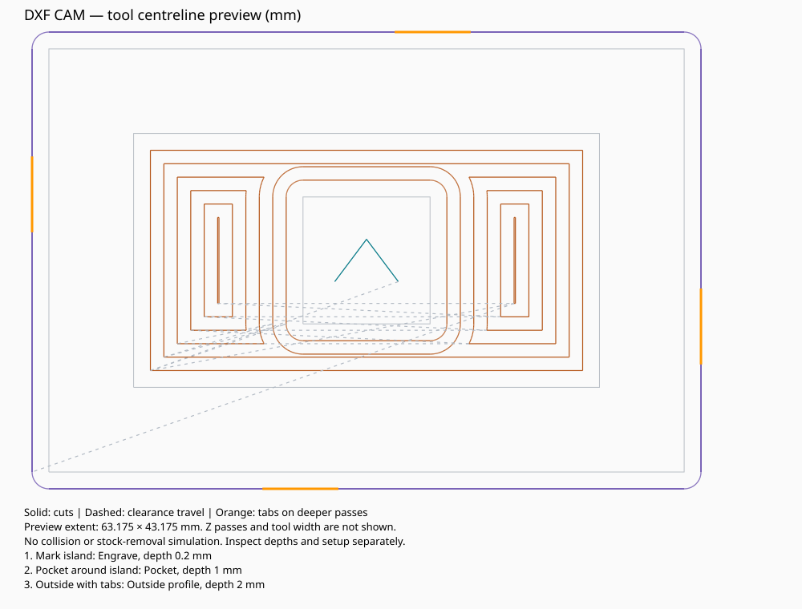

# DXF → G-code — 2.5D CAM

**v0.3.0 · Experimental · Windows desktop application**

Convert flat DXF drawings into multi-depth engraving, inside/outside profiles and pockets with islands. Add holding tabs and preview the cutter's movements before exporting GRBL-style G-code.

**Software-tested; not tested on a physical CNC.** This application writes files only. Simulate the program and perform an air cut before supervised scrap testing.

[Download a release](https://github.com/smegoff/ZL1MC/releases) · [Changes](CHANGELOG.md) · [Validation](VALIDATION.md) · [Development status](IMPROVEMENTS.md)



## Install and start — no Python knowledge needed

1. Download `DXF-to-Gcode-2.5D-v0.3.0.zip` from Releases.
2. **Extract all files**, for example to `C:\CNC\DXFtoGcode`. Do not run from inside the ZIP.
3. Double-click **Setup.cmd**. An internet connection is needed for setup.
4. When setup says it is ready, close that window.
5. Double-click **Start_Converter.cmd**.

Setup finds Python 3.10–3.14 with Tk support, or tries to install Python 3.13 for your Windows account using `winget`. It installs libraries into a private `.venv` folder here. It does not change CNC firmware or permanently change PowerShell execution policy. No administrator shell is normally needed.

If automatic Python installation fails, install [Python 3.13 for Windows](https://www.python.org/downloads/windows/) with pip, Tcl/Tk and the Python launcher enabled, then rerun Setup.cmd. Keep **all application files** together: this version uses several Python modules.

Optional manual setup, from PowerShell in the extracted folder:

```powershell
py -3 -m venv .venv
.\.venv\Scripts\python.exe -m pip install -r requirements.txt
.\.venv\Scripts\python.exe dxf_to_gcode_gui.py
```

## Try the example

The example cutter, feeds, depths and limits are **illustrative**, not recommendations for your material or machine.

1. Start the converter and click **Open job…**.
2. Open `examples/stepped_sign.job.json`. It references the matching DXF automatically.
3. Review **Stock & machine setup**. The example assumes 2 mm stock; check every value before a real cut.
4. Click **Build preview** and wait for completion.
5. Use the mouse wheel to zoom; drag the background to pan; click **Fit** to reset.
6. Use the operation selector and depth slider to inspect operations/passes. The slider's leftmost position shows all passes.
7. Switch **Top XY** to **Side XZ** to see depth, plunges and retracts. Enable **Cutter width** for a top-view width overlay.
8. Review **Job details / warnings**, then **Export G-code…** for inspection in a simulator/sender.

The 60 × 40 mm example engraves a mark 0.2 mm deep on an island, pockets around it to 1 mm, and profiles the outside to 2 mm with four tabs. About 2.205 mm² of uncleared pocket material is reported, largely sharp internal corners a round cutter cannot reach.

The README image and exported SVG are static top views. Depth, side-view and editing controls are in the desktop application.

## Operations and drawing preparation

2.5D means cutting flat shapes at different depths through shallower passes. It supports stepped recesses and flat-bottomed pockets, not curved 3D surfaces or STL models.

| Operation | Behaviour |
|---|---|
| Engrave | Follows lines with the cutter centre; open paths allowed |
| Inside profile | Cuts inside a closed contour, allowing for cutter width |
| Outside profile | Cuts outside a closed contour, allowing for cutter width |
| Pocket | Clears closed contours with offset loops; nested contours form islands |

- Use modelspace DXF geometry at **Z=0**. Drawing elevation is not a machining depth.
- Use layers such as `LETTERING`, `POCKET`, `HOLES` and `OUTLINE` for different operations.
- Profiles/pockets need closed contours. Matching individual line endpoints work; joined polylines are easiest.
- Clean up duplicate lines, gaps, crossings and touching boundaries in CAD.
- Put pocket boundaries and islands on one layer. Alternating nesting levels mean pocket, island, pocket, etc.
- Put profile holes and outside outlines on separate layers/operations. Nested profile contours in one operation are rejected.
- Convert text to outlines in CAD. Ignored non-path entities are listed in the import report.

Supported geometry: LINE, ARC, CIRCLE, ELLIPSE, SPLINE, LWPOLYLINE, ordinary POLYLINE, HATCH boundaries and nested INSERT blocks. Curves become short straight moves.

After selecting the DXF, choose source units (**Auto**, **mm**, **inch**); unitless files need an explicit choice. Leave Scale at 1 unless resizing. Curve tolerance is in mm (default 0.02, minimum 0.001); smaller values increase detail/file size and are not a machining-accuracy guarantee.

**Drawing origin** preserves CAD coordinates, including negatives. **Lower left** shifts the whole drawing's minimum X/Y to zero. Click **Load** after changing import settings and check the reported dimensions.

**All cutting settings and G-code use mm.** Inch drawings are converted. Scale changes the drawing, not cutter diameter, depth or feeds.

## Add and edit operations

1. Choose a layer (`*` means all imported layers) and operation type.
2. Enter the actual cutter diameter. V-bit width varies with depth and is not calculated automatically.
3. Enter a positive **Final depth below stock top**: 1 means final Z = −1 mm.
4. Enter **Maximum depth per pass**: depth 1 / stepdown 0.3 gives −0.3, −0.6, −0.9, −1.0 mm.
5. For pockets, stepover must be greater than 0 and at most 50% of cutter diameter.
6. Set cutting/plunge feeds in mm/min for your actual tool, stock and machine.
7. Click **Add**. To edit an existing operation, select it, change fields and click **Apply**.

Unapplied changes are marked and disable Export. On selection change, build, save or close, choose Apply, Discard or Cancel. Irrelevant fields are disabled.

Use arrows to reorder operations. Engraving/pockets normally precede through-cut outlines. The program follows your list and completes each operation's passes before the next. It does not infer when a part could come loose.

**Duplicate**, **Undo**, **Redo** affect operation-list changes, including tab placement, not drawing selection or global setup. Shortcuts: Ctrl+S save, Ctrl+O open, Ctrl+Z undo, Ctrl+Y redo.

Use one physical cutter per job; mixed diameters are rejected. Export separate jobs for different tools.

### Holding tabs

Tabs are for Outside profile; count 0 disables them. Width is the intended bridge width along a straight cut (the raised path includes an extra cutter diameter). Height is measured **up from the final cut bottom**.

Example: depth 3 and tab height 0.6 raise the tool to Z = −2.4 mm over the tab. Enabled setup checks reject tabs that would retain no material in the configured stock.

Build preview, then drag orange handles along the contour. The job rebuilds automatically. Overlapping tabs are rejected. Inspect corner locations: width assumptions are most reliable on straight cuts. Tabs wrapping around the contour start, including raised initial entry, are supported.

**Reset tabs** restores even spacing. Reset after changing count, tool size, drawing, scale or origin if custom positions no longer match the contours. Positions are saved with the job.

## Stock and machine setup

GUI checks are enabled by default. Legacy jobs retain disabled checks and show a warning until configured. Defaults are examples, not measurements of your machine.

| Setting | Meaning |
|---|---|
| Stock thickness | Actual material thickness below Z=0 |
| Spoilboard allowance | Permitted depth below the stock bottom |
| Highest fixture | Highest fixture top above stock-top Z=0 |
| Exposed tool length | Collet-to-tip length; must exceed depth plus fixture height |
| G54 X/Y envelope | Allowed envelope for the full cutter footprint |
| G54 Z limits | Allowed tool-tip positions in work coordinates |
| Safe Z | Retract above fixtures and within Z limits |
| Spindle S / startup delay | M3 value and startup dwell; verify against your controller/spindle |

These limits are **G54 work coordinates**, not homed machine coordinates. Choose them for your sender's work zero. Outside profiles extend beyond drawing edges. The program does not calculate machine-to-work offsets.

Checks cover depth, reach, tab retention, cutter envelope and rapid clearance. They do **not** model clamp XY positions, holder shapes, stock removal or cross-operation collisions.

Entries plunge vertically; use a suitable centre-cutting tool. No ramp/helix entry, tool changes, finishing allowance, cutting-direction selection or 3D surfaces. If M3 is disabled, arrange spindle control yourself; M5 is still output at the beginning/end.

## Preview and cancellation

Solid coloured lines are cuts; dashed lines are clearance travel. Orange marks tabs. Red boundaries show uncleared pocket material; top-view red dots show plunges. Side XZ shows vertical motion with Y collapsed.

Cutter width is a geometric overlay, not stock-removal simulation. Repeated passes overlap in All passes; use the operation/depth controls to inspect detail. Pocket warnings can indicate sharp corners, narrow areas or centre remnants. A successful export does not mean every pocket area was cleared.

Import, planning and export run in background tasks. **Cancel** stops at a checkpoint; a single DXF-reader or geometry-library call may finish first. Motion data is cached and redraws debounced; large canvas redraws can still take time.

## Save, reopen and export

**Save job…** includes the drawing's relative path where possible, SHA-256 fingerprint, settings, operations, tab positions and selection. Move the job and DXF together. Changed drawings prompt for review; missing references are reported. Old unversioned JSON jobs still load with a separately selected DXF.

The drawing fingerprint is rechecked before export; rebuild after source changes.

| File | Contents |
|---|---|
| `part.gcode` | GRBL-style program: G54, absolute coordinates, mm |
| `part.preview.svg` | Static top-view preview |
| `part.report.json` | Settings, notices, move count and G-code checksum |

All three files are generated/staged before replacement. Ordinary write failures or cancellation during replacement restore the previous bundle. A backup journal allows recovery after process interruption. This is **recoverable sequential replacement**, not an atomic three-file filesystem transaction or a guarantee against hardware/power failure.

If recovery is offered, do not proceed while another instance is exporting the same target. Keep the hidden `.part.export-transaction` folder until recovery finishes; it holds the previous files. CLI recovery:

```powershell
.\.venv\Scripts\python.exe cam.py --recover-export C:\CNC\part.gcode
```

## Before machining

Inspect the full program in a simulator/sender. Confirm cutter, stock, workholding, feeds, depths, spindle settings, tabs, travel and clearances. Set G54 XY to the chosen origin and Z=0 to stock top. Follow your machine's air-cut procedure, then supervise a scrap test. No physical CNC validation has been performed.

## Troubleshooting

| Issue | Action |
|---|---|
| Setup fails | Install Python 3.13 with Tcl/Tk and pip, rerun Setup.cmd |
| Missing module | Use Start_Converter.cmd; keep all application files together |
| Wrong dimensions | Check source units, scale and reported size |
| Bad contours | Clean/join geometry in CAD; Engrave accepts open paths |
| Tool too large / split profile | Use a smaller cutter or revise the shape |
| Profiles too close | Increase spacing or reduce cutter size; the cut would enter a neighbour |
| Envelope exceeded | Check G54 limits, origin and cutter size rather than simply disabling checks |
| Unapplied edits | Apply or Discard before export |
| Changed tab contours | Reset tabs, rebuild and place them again |
| Export disabled | Resolve edits and build a current preview |
| Interrupted export | Recover the previous bundle as above |

## Developer notes

Modules separate models, DXF import, geometry/tabs, motion planning, G-code postprocessing, persistence, previews and UI workflow. `cam.py` remains the public API and CLI; `version.py` supplies the shared release version.

```powershell
.\.venv\Scripts\python.exe -m unittest discover -s tests -v
.\.venv\Scripts\python.exe cam.py examples\stepped_sign.dxf examples\stepped_sign.job.json examples\stepped_sign.gcode
.\.venv\Scripts\python.exe build_release.py
```

Windows CI uses Python 3.11/3.13, requires real Tk tests rather than skips, exports the example and builds the ZIP. CLI exports replace targets without prompting and enforce saved drawing fingerprints.

References: [ezdxf paths](https://ezdxf.readthedocs.io/en/stable/path.html), [Shapely operations](https://shapely.readthedocs.io/en/2.1.0/manual.html), [GRBL commands](https://github.com/gnea/grbl/blob/master/doc/markdown/commands.md). Offsets are calculated in software; G41/G42 compensation is not required.
